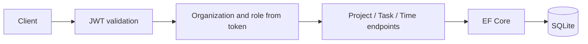

# NeoTasks .NET

Task and time tracking API with separate data for each organization. Based on the task domain from the [NeoTasks challenge](https://github.com/LucianoNeo/ingacode-test-backend). The deployed React application still uses Fastify; this API runs separately.

## Run

From `projects/`:

```sh
# PowerShell: $env:ASPNETCORE_ENVIRONMENT='Development'
# bash: export ASPNETCORE_ENVIRONMENT=Development
dotnet run --project neotasks-dotnet/NeoTasks.Api --urls http://localhost:5081
```

`GET /health` checks process availability. `GET /openapi/v1.json` provides the API schema in Development. `examples.http` contains a complete signup/project/task/time flow. Copy the returned token and IDs into its variables. SQLite creates `neotasks.db` in the process working directory.

## Endpoints

| Method | Route | Access |
| --- | --- | --- |
| POST | `/auth/register` | Public; creates a new organization and its Owner |
| POST | `/auth/login` | Public; returns a 30-minute JWT |
| POST | `/api/members` | Owner; creates a member in the token's organization |
| GET | `/api/projects?page=1` | Authenticated; 20 projects per page, organization-scoped |
| POST | `/api/projects` | Owner |
| GET / POST | `/api/projects/{id}/tasks` | Organization member; GET returns up to 100 tasks |
| PUT | `/api/tasks/{id}` | Organization member; requires current `version` |
| POST | `/api/tasks/{id}/time` | Organization member; 1–86400 seconds |

## Access rules and updates



Organization is derived from signed claims, not a caller-supplied tenant header. Reads and writes filter by organization. Composite foreign keys prevent tasks from referencing a project in a different organization. Passwords use ASP.NET Core PasswordHasher. Task version is an EF concurrency token; stale updates return 409. Cross-organization resource IDs return 404.

Tests cover tenant read/write boundaries, role restrictions, time validation, stale versions, anonymous access, invalid login and missing credentials.

## Configuration and limits

`ConnectionStrings__Database` overrides SQLite location. `Jwt__Key` must contain at least 32 bytes; the sample signing key is available only in Development. A public deployment needs a signing key and HTTPS. No refresh tokens, password reset, email verification, rate limiting or audit log yet. Database creation uses EnsureCreated; migrations are required for schema evolution. Time entries are creation-only in this MVP.

## Português

API de organizações, projetos, tarefas e horas. JWT identifica usuário, organização e papel; Owner cria projetos e membros. Os testes verificam que uma organização não acessa dados de outra e que atualizações com versão antiga são recusadas. Para executar, configure `ASPNETCORE_ENVIRONMENT=Development` e use os comandos acima. A interface antiga ainda não foi conectada a esta API.
