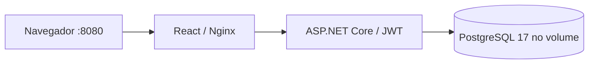

# NeoTasks — React + .NET

[](https://github.com/LucianoNeo/portfolio/actions/workflows/neotasks-ci.yml)

Juntei a interface React do meu desafio de tarefas com uma API em C#/.NET. O projeto permite criar uma organização, cadastrar colaboradores, organizar tarefas por projeto e registrar o tempo de trabalho. Mantive o visual e os componentes da interface original e adaptei o contrato para o novo backend.

## Para avaliar o projeto

Você precisa de Git e Docker com Compose. Não precisa instalar Node, .NET ou um banco separado.

```sh
git clone https://github.com/LucianoNeo/portfolio.git
cd portfolio/projects/neotasks-dotnet
docker compose up --build
```

Abra **http://localhost:8080**. Clique em **Criar uma organização** e cadastre seu nome, organização, e-mail e senha com pelo menos 12 caracteres. Esse primeiro usuário será o administrador. Não há conta compartilhada nem dados de produção.

Um roteiro de cinco minutos:

1. Crie um projeto no menu Projetos.
2. Cadastre uma pessoa em Colaboradores. Ela poderá entrar com o e-mail e a senha inicial informados.
3. Crie uma tarefa e atribua um colaborador.
4. Use Iniciar e Finalizar para registrar o tempo, ou informe um período já trabalhado.
5. Confira o Dashboard e o Relatório. Saia e entre como colaborador para comparar as permissões.

O Docker baixa e compila as imagens na primeira execução. A API aguarda a criação do banco e a interface aguarda a API ficar saudável. A porta da API fica apenas na rede interna; o Nginx encaminha as chamadas da interface.

## Parar, retomar e preservar dados

```sh
docker compose down
docker compose up -d
```

O volume `neotasks-postgres` preserva usuários, projetos, tarefas e horas, inclusive após reiniciar os containers. `docker compose down -v` apaga esse banco; use apenas se quiser recomeçar a avaliação.

Se a porta 8080 estiver ocupada, copie `.env.example` para `.env` e mude `NEOTASKS_PORT`. A senha do banco pode ser configurada em `NEOTASKS_DB_PASSWORD`. O PostgreSQL fica apenas na rede interna do Compose. A configuração de exemplo só publica em 127.0.0.1. Ela inclui uma chave JWT conhecida para facilitar a avaliação local; substitua `NEOTASKS_JWT_KEY` por uma chave própria de pelo menos 32 bytes antes de disponibilizar a aplicação a terceiros.

## Como está organizado

| Pasta/arquivo | Responsabilidade |
| --- | --- |
| `frontend/` | React 18, TypeScript, Vite e Tailwind; interface original adaptada |
| `NeoTasks.Api/` | ASP.NET Core .NET 10, EF Core e PostgreSQL |
| `NeoTasks.Tests/` | Testes de integração com banco PostgreSQL real |
| `compose.yaml` | API, PostgreSQL, Nginx e volume persistente |
| `frontend/e2e/` | Playwright: cadastro, equipe, tarefas, horas, permissões e persistência |



O Nginx atende a interface e encaminha `/app-api` à API na mesma origem. Esse grupo devolve os formatos usados pelos componentes React: projetos com `Tasks`, tarefas com `TimeTracker` e colaboradores sem dados de senha. As rotas anteriores `/auth` e `/api` continuam disponíveis para clientes da API; `examples.http` mostra esse contrato. `/health` verifica disponibilidade. O OpenAPI em `/openapi/v1.json` fica disponível apenas em Development.

A organização vem das claims do JWT. IDs de outra organização retornam 404. Somente Owner cria, edita ou exclui projetos e cadastra colaboradores; membros trabalham nas tarefas e nos apontamentos da própria organização. Senhas usam ASP.NET Core PasswordHasher. Tarefas e apontamentos usam controle de concorrência; uma versão de tarefa desatualizada retorna 409. Horários são armazenados em UTC e os totais consideram o fuso enviado pelo navegador, dividindo apontamentos que atravessam a meia-noite.

## Validação automática

O [GitHub Actions](https://github.com/LucianoNeo/portfolio/actions/workflows/neotasks-ci.yml) executa os testes da API, compila as duas imagens e sobe o Compose num runner Linux. Depois, o Playwright percorre a interface no Chromium e reinicia os containers do banco e da API para verificar a persistência. Os relatórios e traces ficam nos artefatos da execução.

Para executar esses testes em um ambiente de desenvolvimento:

```sh
# Na raiz do repositório:
# O runner usa PostgreSQL real; localmente configure uma instância de testes.
# PowerShell: $env:NEOTASKS_TEST_DATABASE='Host=localhost;Database=postgres;Username=postgres;Password=sua-senha'
# O usuário de teste deve poder criar e excluir bancos isolados.
dotnet test projects/neotasks-dotnet/NeoTasks.Tests
# Com o Compose em execução:
cd projects/neotasks-dotnet/frontend
npm ci
npx playwright install chromium
npm run test:e2e
```

Esses comandos extras são opcionais para quem quiser estudar ou modificar o código. A avaliação pelo navegador exige apenas o Compose.

## Origem e limites

A interface veio de [ingacode-test-frontend](https://github.com/LucianoNeo/ingacode-test-frontend), commit `2083dfc646e7f3aee84caab673dee1c0bd902685`. O domínio foi inspirado no [backend original em Fastify](https://github.com/LucianoNeo/ingacode-test-backend). Nesta pasta, a interface usa exclusivamente a API .NET; não depende daqueles serviços externos.

Este é um projeto de demonstração. Ainda faltam recuperação de senha, verificação de e-mail, renovação de token, rate limiting e auditoria. A sessão dura 30 minutos e pede novo login ao expirar. O contrato da interface carrega as coleções da organização sem paginação; para grande volume, eu paginaria esses endpoints. Apontamentos abertos não entram no total até serem finalizados; cada apontamento aceita até 24 horas. Lançamentos antigos feitos pela rota de segundos continuam no total por tarefa, mas sem uma data não podem aparecer nos totais de calendário.

O banco usa EnsureCreated na primeira execução. Uma implantação duradoura precisa de migrations, HTTPS e gestão de segredos. Bancos SQLite da antiga API e bancos do desafio Fastify não são importados automaticamente; esta aplicação inicia seu próprio banco PostgreSQL. Não copie um volume existente desses projetos para este Compose.

## English

A complete React + ASP.NET Core task and time tracking application. Clone this repository, open `projects/neotasks-dotnet`, run `docker compose up --build` and visit **http://localhost:8080**. Create an organization first; its first user becomes Owner. Owners manage projects and team members; members manage their organization's tasks and time entries. PostgreSQL data survives container restarts through a named volume.

The frontend is adapted from my original React challenge and now talks to the .NET API through Nginx. GitHub Actions builds and runs the Compose stack and checks the browser flow with Playwright. This is an evaluation project, with the limitations documented above.
