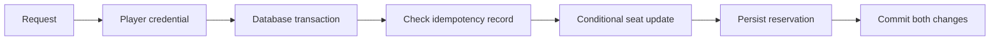

# Raid Booking API

A limited-capacity registration lab inspired by raid scheduling. It has no connection to Pokémon GO servers or player accounts.

## Run

From `projects/`, set `ASPNETCORE_ENVIRONMENT=Development` and run:

```sh
dotnet run --project raid-booking/RaidBooking.Api --urls http://localhost:5082
dotnet test raid-booking/RaidBooking.Tests
```

Development API schema: `/openapi/v1.json`. `examples.http` shows the flow. Create a player, copy its returned token, create a future raid as administrator, then reserve a seat with `X-Player-Token` and `Idempotency-Key`.

## Endpoints

| Method | Route | Access |
| --- | --- | --- |
| POST | `/players` | Public; issues a random anonymous player credential, stores only SHA-256 hash |
| POST | `/raids` | `X-Admin-Key`; name, capacity 1–100, future Unix `startsAt` |
| GET | `/raids` | Public; next 100 by start time |
| GET | `/raids/{id}` | Public; capacity and current seat count |
| POST | `/raids/{id}/reservations` | Player credential + idempotency key |
| DELETE | `/reservations/{id}` | Credential of the reservation's player |

## Consistency model



The seat increment is conditional on `SeatsTaken < Capacity`. Counter and reservation commit together. A check constraint enforces the bounds; a partial unique index permits one active reservation per player/raid. Repeating the same idempotency key returns the original reservation, including its cancelled state. Use a new key to book again after cancelling.

Tests send 20 parallel HTTP booking requests to one seat: exactly one is created and 19 conflict. They also verify replay, repeated cancellation and another player's denied cancellation. These are correctness tests, not throughput benchmarks.

## Configuration and limits

`ConnectionStrings__Database` sets SQLite path; `AdminKey` is required outside Development (minimum 16 characters). Development example: `local-demo-admin-key`. Player tokens are bearer credentials; no recovery or identity verification is provided. SQLite serializes writers; PostgreSQL and load testing are next steps. Notifications, Redis, waiting lists, credential rotation and rate limiting are not implemented. Tokens must be transported over TLS in any public deployment.

## Português

Laboratório de reservas com capacidade limitada. A reserva e o contador são gravados na mesma transação; Idempotency-Key permite repetição segura. O teste de concorrência disputa uma única vaga entre 20 jogadores. Credenciais são anônimas e não são contas reais de Pokémon. Execute com os comandos acima e use o arquivo de exemplos.
