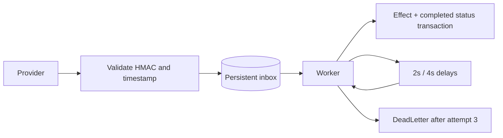

# Webhook Inbox

Signed event intake and a persistent worker. The only implemented effect is a local `points.awarded` ledger entry. Demonstrates deduplication, retries and recovery without pretending to provide exactly-once delivery across external services.

## Run

From `projects/`, set `ASPNETCORE_ENVIRONMENT=Development`:

```sh
dotnet run --project webhook-inbox/WebhookInbox.Api --urls http://localhost:5083
# In a second terminal:
python webhook-inbox/send-event.py --id demo-1
python webhook-inbox/send-event.py --id demo-1
dotnet test webhook-inbox/WebhookInbox.Tests
```

The simulator sends signed requests, then prints the admin-protected processing status. The second delivery is a duplicate with the same body. Use `--kind unsupported` and a new ID to observe retries and DeadLetter. It uses fictional payloads and local demo keys; override keys with environment variables rather than command-line arguments.

## Protocol

`POST /webhooks` expects JSON and:

- `X-Event-Id`: a stable provider event ID, max 100 characters.
- `X-Timestamp`: current Unix timestamp; ±5-minute window.
- `X-Signature`: hexadecimal HMAC-SHA256 over UTF-8 `timestamp.eventId.body` using `WebhookSecret`.

Success: 202. Duplicate with identical body: 202. Reused ID with changed body: 409. Invalid or expired signature: 401. Maximum body: 64 KiB. The event ID is included in the signature, so changing it invalidates the request.

`GET /events/{id}` requires `X-Admin-Key` and returns status, attempts and a sanitized error. `GET /health` checks process availability; OpenAPI JSON is exposed in Development only.



## Failure and replay guarantees

SQLite transactions serialize writers. The worker persists the award and completed status together. A crash before commit rolls both back; a pending event is available after restart. The award primary key is the event ID. This guarantee covers the local database only. External side effects need an outbox and destination idempotency.

Invalid/unsupported events demonstrate retry and DeadLetter behavior. There is no redrive endpoint yet. The example award ledger is order-independent; ordering-sensitive consumers require sequence/version checks. No event payloads or keys are included in processing logs.

Tests cover ten concurrent duplicate deliveries with one effect, changed-payload conflicts, invalid/expired signatures, restart and dead letters with a controlled clock.

## Configuration

`WebhookSecret` and `AdminKey` are required outside Development; minimum 16 characters. Local examples: `local-demo-webhook-secret` / `local-demo-admin-key`. `ConnectionStrings__Database` controls persistence. `Worker__Enabled=false` disables automatic processing for tests. Public hosting requires TLS and operational hardening; this lab has no distributed broker, retention policy or dashboard.

## Português

Inbox de eventos assinados com HMAC, deduplicação e worker persistente. A assinatura inclui timestamp, ID e corpo. O efeito local e o status concluído são confirmados juntos; três falhas levam a DeadLetter. Os testes cobrem entregas concorrentes, assinatura, reinício e espera progressiva. A garantia se limita ao mesmo banco de dados.
